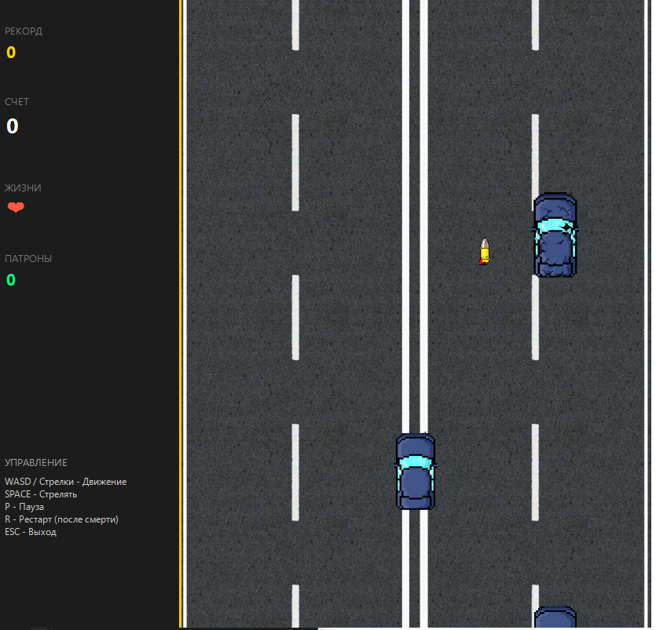

# 🏎️ Racing Game

Аркадная гоночная игра на C#

## 🕹️ Описание игры
Вы управляете автомобилем на оживленной трассе. Ваша задача — продержаться как можно дольше, избегая столкновений с трафиком и препятствиями. У вас есть пушка, чтобы расчищать путь, но патроны ограничены!

### Особенности:
*   **Архитектура MVC**: Полное разделение логики, управления и отрисовки.
*   **Умный трафик**: Машины едут по полосам.
*   **Система аварий**: При врезании автомобиля в бочку, он разбивается.
*   **Unit-тесты**: Логика игры покрыта тестами (MSTest).

---

## 🎮 Управление
Игра поддерживает два типа раскладки:

| Клавиша | Действие |
| :--- | :--- |
| **W / ↑** | Движение вверх |
| **A / ←** | Движение влево |
| **S / ↓** | Движение вниз |
| **D / →** | Движение вправо |
| **Space** | Стрельба |
| **P** | Пауза |
| **R** | Перезапуск (после поражения) |
| **Esc** | Выход из игры |

---

## 🏗️ Архитектура проекта
Проект разделен на три основных компонента:

1.  **Model (`GameEngine.cs`)**
2.  **View (`Form1.cs`)**
3.  **Controller (`GameController.cs`)**

---

## 🛠️ Сборка и запуск
1.  Установите **Visual Studio 2019/2022**.
2.  Клонируйте репозиторий
3.  Откройте проект.
4.  Нажмите **F5** для запуска.

---

## 📸 Скриншоты

